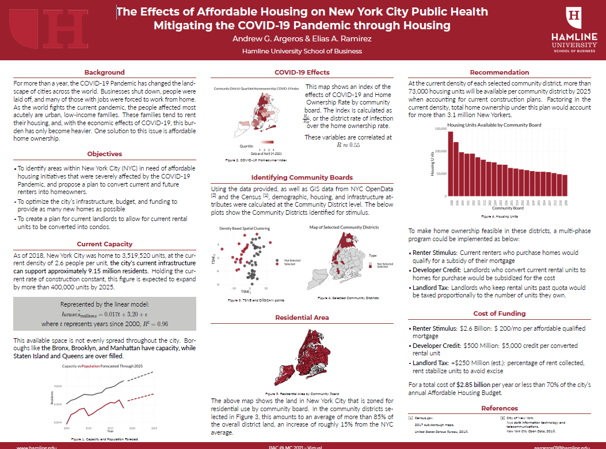

# BAC @ MC 2021

## Contributors: [Andrew Argeros](https://www.linkedin.com/in/andrewargeros/) and [Elias Ramirez](https://www.linkedin.com/in/elias-ramirez-366881202/) [][HU]
##### **[Max Bolger](https://www.linkedin.com/in/max-bolger/) started work in this project but left before significant contribution*

This repo houses all the code used in our entry to the [2021 Business Analytics Competition at Manhattan College](https://manhattan.edu/academics/schools-and-departments/school-of-business/business-analytics-competition/index.php) for Phase I of the competition.

### The Problem 📃

This year, the topic of the conference was around affordable housing and the effects of the COVID-19 Pandemic. The entire problem outline can be found in the file `BAC@MC2021-Story.pdf`.

### Data 💾

All of the data used for this competition are stored in the folders `/Data` and `/Shapefiles`. Files in `/Data` with the prefix `NYC-` were supplied by the competition hosts. The other two files were created as aggregates of the competition data files. A data dictionary is also listed at `/Data/BAC@MC2021-data-definitions.xlsx` and can be used for context.

##### Shapefiles 🌎

|Name                                 | Source        | Description                |
|-------------------------------------|---------------|----------------------------|
|`nyc_census2010_tracts.zip`          | Census        | *Not Used*                 |
|`nyc_community_dists.geojson`, `.zip`| NYC Open Data | Map of NYC Community Boards|
|`nyc_zoningarea.geojson` , `.zip`    | NYC Open Data | Map of Land Zoning Type    |
|`zcta_borocd_merged.geojson`         | Created       | Convert sub-borough to CD  |

## Methodology 👨🏻‍💻

To identify districts for funding we used a combination of T-Stochastic Neighbor Embedding (t-SNE) and Density Based Spatial Clustering of Applications with Noise (DBSCAN) to first reduce the dimensions of the aggregated community board level data, then to find non-parametric, non-radial clusters of like areas. This identified one cluster for funding, and one to avoid.

We then analyzed the amount of livable space within the target districts via the shapefiles above, calculated the number of housing units, and factored in new plans for construction.

We then proposed a plan to make this feasible, within the city's annual housing appropriations.

Our proposal would have make home ownership available for an additional 3.1 million New Yorkers for a cost of $2.85 billion dollars, or 70% of New York City's annual affordable housing budget.

[HU]: https://www.hamline.edu/
